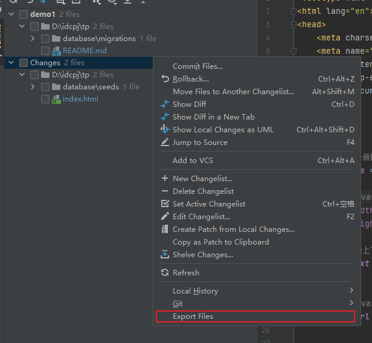
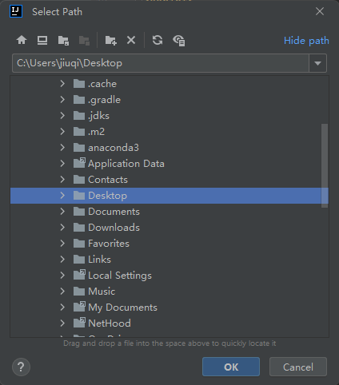
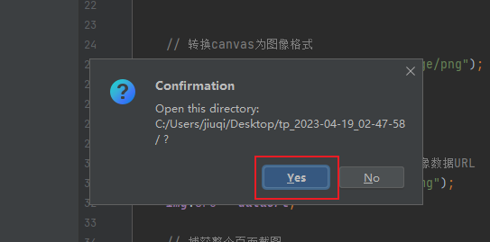

## 背景
当使用 PHP 为语言进行开发时，时常有增量覆盖系统环境中的个别文件，并且由于个人开发项目时，ChangeList 进行管理。于是使用此插件，可以批量导出某个 ChangeList 中的文件

## 效果
1.选择 IDEA 右侧 Commit 标签，右键选择 Export Files



2.在 Select Path 中，选择想要保存的地方



3. 点击 “YES” 打开指定保存的文件



4. tp_2023-04-19_02-47-58 目录中的文件就是 ChangeList 中的文件
```
tp_2023-04-19_02-47-58
 ├── database
 │   └── seeds
 │       └── User.php
 ├── index.html
 └── path.txt
```

## TODO

- [x] 导出指定的 ChangeList 中的文件，并生成文件夹
- [ ] 针对ChangeList 中勾选的文件进行导出
- [ ] 编写脚本，在创建前，根据 path.txt ,对目标文件进行备份